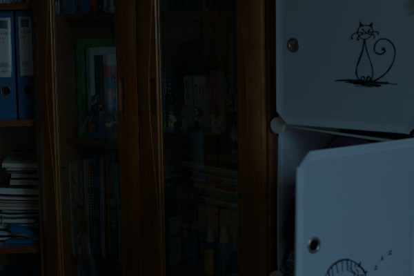
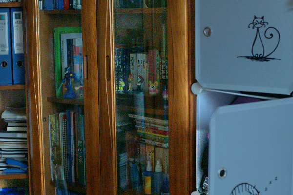

# Low-light-Image-Enhancement

This repository provides a Python implementation of two low-light image enhancement techniques based on illumination map estimation, inspired by the following papers:

* Dual Illumination Estimation for Robust Exposure Correction
* LIME: Low-light Image Enhancement via Illumination Map Estimation

Both methods leverage Retinex modeling to estimate the illumination map, aiming to enhance image structures while reducing redundant texture details. They share the same optimization formulation for illumination estimation (as referenced in the papers).

The key advancement introduced by the first method (referred to as DUAL) over the second (LIME) is its dual illumination estimation approach. Unlike LIME, which estimates the illumination map only for the original image, DUAL also processes the inverted version. This enables it to effectively correct both under-exposed and over-exposed areas.

This implementation supports both methods, and users can easily switch between them using script parameters.

## Pre-requisities
  python >= 3.7
  numpy
  scipy
  opencv-python
  tqdm

## Usage
Run demo.py file

## Output
Low Light Image             |  Enhanced Image
:-------------------------:|:-------------------------:
  |  
